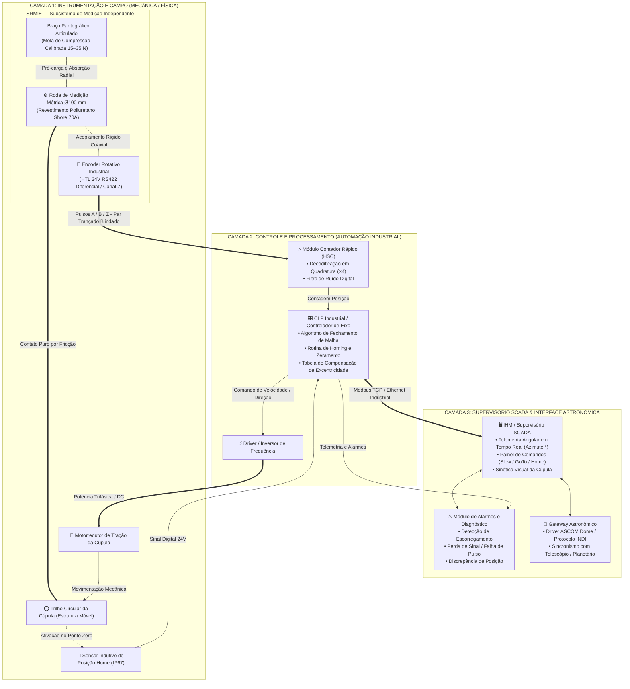
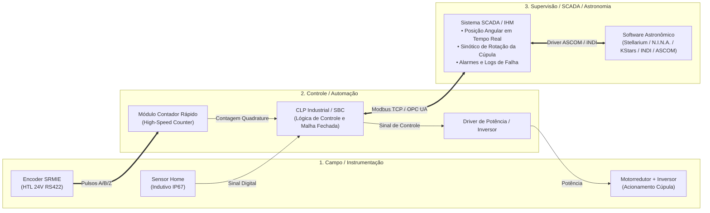

# Sistema de Roda de Medição Independente com Encoder para Rastreamento de Posição Angular de Cúpulas Astronômicas

**Documento Técnico — Revisão 1.0**
**Data:** Setembro de 2026
**Classificação:** Engenharia de Instrumentação e Automação Industrial

---

## Índice

1. [Resumo Executivo e Princípio de Operação](#1-resumo-executivo-e-princípio-de-operação)
2. [Especificações Técnicas e Dimensionamento](#2-especificações-técnicas-e-dimensionamento)
3. [Vantagens, Limitações e Modos de Falha](#3-vantagens-limitações-e-modos-de-falha)
4. [Procedimento de Instalação, Calibração e Manutenção](#4-procedimento-de-instalação-calibração-e-manutenção)
5. [Produtos de Mercado e Estimativa de Custos (BOM)](#5-produtos-de-mercado-e-estimativa-de-custos-bom)

---

## 1. Resumo Executivo e Princípio de Operação

### 1.1 Descrição Funcional do Conjunto

O **Sistema de Roda de Medição Independente com Encoder** (SRMIE) é uma solução de instrumentação dedicada ao rastreamento preciso da posição angular de cúpulas astronômicas, plataformas giratórias industriais e estruturas anulares de grande diâmetro. Diferentemente de técnicas de medição que dependem do eixo motor ou de elementos ópticos externos, este sistema opera pelo **princípio de contato direto puro (direct-contact measuring wheel)**, desacoplando completamente a função de medição da função de acionamento.

#### Arquitetura do Sistema e Topologia SCADA



#### Princípio de Operação

1. **Contato Mecânico Precarregado:** O braço pantográfico, articulado no chassi fixo da cúpula, pressiona a roda de medição contra a superfície lateral (ou inferior) do trilho circular com força controlada pela mola calibrada.
2. **Transmissão de Movimento:** A rotação da cúpula desloca o trilho tangencialmente, rolando a roda de medição sem escorregamento apreciável — condição garantida pela combinação de pré-carga adequada e material de alta aderência (poliuretano Shore A 60–80).
3. **Transdução Angular:** O eixo da roda está acoplado rigidamente ao eixo do encoder rotativo. Cada rotação da roda gera N pulsos (PPR do encoder), que são interpolados pelo controlador para determinar o deslocamento angular incremental da cúpula.
4. **Compensação de Imperfeições:** Excentricidades do trilho, emendas de trilho, variações de temperatura e deformações elásticas são absorvidas pelo curso de compensação do braço pantográfico, mantendo contato contínuo sem aplicar esforços destrutivos ao encoder.

---

### 1.2 Comparativo Técnico: Três Abordagens de Medição de Posição

| Critério de Avaliação | **Fita Métrica + Leitor Óptico** | **Encoder no Eixo do Motor** | **Roda de Medição Independente (SRMIE)** |
|---|---|---|---|
| **Princípio** | Leitura óptica de marcas em fita magnética/óptica colada ao trilho | Pulsos gerados no eixo do motor; posição calculada via relação de transmissão | Contato direto da roda com o trilho; encoder acoplado ao eixo da roda |
| **Resolução Típica** | 0,01 mm linear (excelente) → ~0,001° para cúpula Ø5 m | Limitada por backlash e folga mecânica da transmissão (±0,5° a ±2°) | Configurável; tipicamente 0,01° a 0,1° sem interpolação |
| **Erro Acumulativo** | Nulo (absoluto por natureza óptica) | Alto — erros de escorregamento, folga, desgaste das correias acumulam indefinidamente | Baixo — referenciável pelo canal Z; erro proporcional ao escorregamento residual |
| **Imunidade a Escorregamento** | Imune (sem contato mecânico) | **Vulnerável:** torque de acionamento gera escorregamento na superfície de tração | **Alta:** sem torque de acionamento; único escorregamento é por inércia (controlável por pré-carga) |
| **Complexidade Mecânica** | Alta — fita aderida com precisão em toda a circunferência do trilho; limpeza crítica | Baixa — aproveita o encoder já instalado no motor | Média — braço articulado, mola, alinhamento radial |
| **Custo de Instalação** | **Alto:** custo da fita (R\$15–50/m em fitas magnéticas de alta res.), leitores ópticos industriais, alinhamento milimétrico | Baixo (encoder já existente) — custo zero de hardware adicional se encoder presente | **Médio:** roda + encoder + suporte pantográfico (BOM detalhado na Seção 5) |
| **Manutenção** | Fita sujeita a contaminação (óleo, água, poeira), rasgos e descasquemento | Baixa (encoder protegido internamente no motor) | Periódica: inspeção da borracha, limpeza, verificação da pré-carga |
| **Adequação a Ambiente de Cúpula** | Moderada — trilho exposto ao ambiente, fita vulnerável à umidade e temperatura | Alta (motor e encoder na base) | **Alta** — IP65 ou IP67 facilmente obtido; resistente à condensação |
| **Rastreamento de Posição Absoluta** | Sim (com marcas absolutas na fita) | Não (incremental; requer homing) | Incremental + Referência absoluta com canal Z; opcional: encoder absoluto multivoltas |
| **Impacto de Backlash** | Nulo | **Crítico** — folga de engrenagens e correias cria zona morta de posição | Nulo — mede diretamente no trilho |
| **Custo Total Estimado (BRL)** | R\$4.000–R\$18.000 (fita + leitor) | R\$0–R\$800 (aproveitamento do encoder do motor) | **R\$1.200–R\$4.500** (BOM completo) |

> **Conclusão Comparativa:** O SRMIE representa o melhor equilíbrio entre custo, precisão, robustez e independência do sistema de acionamento para cúpulas astronômicas de pequeno a médio porte (diâmetro 3 m a 10 m). Elimina os erros de transmissão mecânica do encoder de motor e a complexidade e vulnerabilidade da fita óptica, mantendo uma relação custo-benefício superior.

---

## 2. Especificações Técnicas e Dimensionamento

### 2.1 Cinemática e Resolução Angular

#### 2.1.1 Modelo Matemático Fundamental

A resolução angular do sistema é determinada pela seguinte cadeia cinemática:

$$\theta_{\text{res}} = \frac{360^\circ}{N_{\text{PPR}} \cdot \left(\frac{D_{\text{trilho}}}{D_{\text{roda}}}\right)}$$

Onde:

- $\theta_{\text{res}}$ — Resolução angular por pulso do encoder [$^\circ$]
- $N_{\text{PPR}}$ — Número de pulsos por revolução do encoder [pulsos/rev]
- $D_{\text{trilho}}$ — Diâmetro efetivo do trilho circular da cúpula [mm]
- $D_{\text{roda}}$ — Diâmetro externo da roda de medição [mm]

**Forma equivalente** em termos de perímetro:

$$\theta_{\text{res}} = \frac{P_{\text{roda}}}{P_{\text{trilho}}} \cdot \frac{360^\circ}{N_{\text{PPR}}}$$

Onde $P_{\text{roda}} = \pi \cdot D_{\text{roda}}$ e $P_{\text{trilho}} = \pi \cdot D_{\text{trilho}}$.

**Resolução em minutos de arco:**

$$\theta_{\text{res}}[\text{arcmin}] = \theta_{\text{res}}[^\circ] \times 60$$

**Com decodificação em quadratura ($\times 4$):**

$$\theta_{\text{res, Q4}} = \frac{\theta_{\text{res}}}{4}$$

A maioria dos controladores modernos processa as bordas de subida e descida dos canais A e B do encoder incremental, efetivamente quadruplicando a resolução.

#### 2.1.2 Exemplos Calculados

| Cenário | $D_{\text{trilho}}$ | $D_{\text{roda}}$ | PPR Encoder | Resolução ($\times 1$) | Resolução ($\times 4$ Quad.) |
|---|---|---|---|---|---|
| Cúpula pequena 3 m | 3.000 mm | 100 mm | 1.000 | 0,012° (0,72') | **0,003° (0,18')** |
| Cúpula média 5 m | 5.000 mm | 100 mm | 2.500 | 0,0058° (0,35') | **0,0014° (0,086')** |
| Cúpula média 5 m | 5.000 mm | 150 mm | 1.000 | 0,0108° (0,65') | **0,0027° (0,16')** |
| Cúpula grande 8 m | 8.000 mm | 120 mm | 5.000 | 0,00108° (0,065') | **0,00027° (0,016')** |

> **Recomendação de projeto:** Para rastreamento de objetos astronômicos com erro de apontamento < 0,1°, é suficiente um encoder de 1.000 PPR com roda de Ø100 mm em cúpulas até 6 m. Para precisão astrométrica superior (< 0,01°), use encoder $\ge 2.500$ PPR com decodificação $\times 4$.

#### 2.1.3 Erro de Diâmetro e Sensibilidade Térmica

A variação do diâmetro da roda por temperatura afeta diretamente a escala de medição:

$$\Delta\theta = \theta_{\text{real}} \cdot \alpha_{\text{PU}} \cdot \Delta T$$

Para poliuretano: $\alpha_{\text{PU}} \approx 150 \times 10^{-6}\ ^\circ\text{C}^{-1}$ (coeficiente de expansão volumétrica $\rightarrow$ coeficiente linear $\approx 50 \times 10^{-6}\ ^\circ\text{C}^{-1}$).

Para uma variação de temperatura de $\Delta T = 30^\circ\text{C}$ (típico ambiente de cúpula, $-5^\circ\text{C}$ a $+45^\circ\text{C}$):

$$\frac{\Delta D_{\text{roda}}}{D_{\text{roda}}} = 50 \times 10^{-6} \times 30 = 0{,}15\%$$

Erro escalar resultante: **0,15%** do ângulo lido. Para uma volta completa: $360^\circ \times 0{,}0015 = 0{,}54^\circ$ de erro total acumulado — aceitável para a maioria das aplicações de cúpula, mitigável por calibração com referência absoluta (canal Z ou sensor home).

---

### 2.2 Dimensionamento Mecânico

#### 2.2.1 Roda de Medição

| Parâmetro | Especificação Recomendada |
|---|---|
| **Material do núcleo** | Alumínio 6061-T6 usinado (leve, rígido, anti-corrosão) |
| **Revestimento** | Poliuretano fundido Shore A 60–75 (equilíbrio aderência/desgaste) |
| **Diâmetro nominal** | 100 mm (padrão métrico — 1 rev = 314,159 mm de percurso) |
| **Largura de contato** | 20–30 mm (distribuição de carga, estabilidade lateral) |
| **Rugosidade do perfil** | Liso (evitar ranhuras que causem vibrações e ruído elétrico no encoder) |
| **Tolerância dimensional** | ±0,05 mm no diâmetro (usinagem CNC — diretamente impacta calibração) |
| **Eixo** | Aço inox 304, Ø12 mm ou Ø15 mm, chanfrado para acoplamento direto ao encoder |
| **Rolamentos** | 2× rolamentos rígidos de esferas (ex.: SKF 6201-2RS), selados, graxados |

#### 2.2.2 Braço Pantográfico

O braço pantográfico é o elemento mecânico que garante o contato contínuo da roda de medição com o trilho, independentemente das imperfeições geométricas da pista.

```
VISTA SUPERIOR — BRAÇO PANTOGRÁFICO

      Ponto de Pivô
      (fixo no chassi)
           │
           │◄── Parafuso de fixação M8 com bucha de nylon (pivô sem folga)
           │
     ┌─────┴──────────────────────────────┐
     │         BRAÇO ARTICULADO           │
     │         (Alumínio Perfilado)       │
     │                                   │◄── Slot para
     │   ┌──Mola de Compressão──┐        │    ajuste de
     │   │   (pré-carga ajust.) │        │    curso máx.
     │   └──────────────────────┘        │
     └─────────────────────────┬─────────┘
                               │
                    ┌──────────┴──────────┐
                    │   SUPORTE DA RODA   │
                    │  + ENCODER          │
                    │  (Bloco usinado)    │
                    └─────────────────────┘
                               │
                               ▼
                        [ TRILHO DA CÚPULA ]
```

| Parâmetro | Especificação |
|---|---|
| **Comprimento do braço** | 150–250 mm (da articulação ao eixo da roda) |
| **Material** | Perfil alumínio 40×20 mm (série 20 Bosch Rexroth) ou placa Al 5 mm |
| **Curso de compensação** | ±8 a ±15 mm radial (absorve excentricidades do trilho) |
| **Pré-carga da mola (estática)** | **15–35 N** (ver dimensionamento abaixo) |
| **Rigidez da mola** | 1,5–3,0 N/mm (mola de compressão média) |
| **Articulação** | Rolamento ou bucha de bronze autolubrificante; folga zero é obrigatória |
| **Batente de curso mínimo** | Evita que o braço retraia além do contato em caso de falha de mola |
| **Trava de transporte** | Pino removível para travas durante manutenção |

#### 2.2.3 Dimensionamento da Força da Mola

A força de contato $F_{\text{mola}}$ deve ser suficiente para:
- **Evitar escorregamento por inércia** durante aceleração/desaceleração da cúpula
- **Não provocar desgaste excessivo** do revestimento elastomérico
- **Não sobrecarregar** os rolamentos do encoder (carga radial máxima típica: 20–50 N para encoders industriais compactos)

**Força mínima anti-escorregamento:**

$$F_{\min} = \frac{m_{\text{cúpula}} \cdot a_{\max} \cdot D_{\text{roda}}}{2 \cdot D_{\text{trilho}} \cdot \mu}$$

Para cúpula de $m = 500\text{ kg}$, aceleração máxima $a_{\max} = 0{,}05\text{ m/s}^2$, $\mu_{\text{PU/aço}} = 0{,}5$:

$$F_{\min} = \frac{500 \times 0{,}05 \times 0{,}1}{2 \times 5 \times 0{,}5} = \frac{2{,}5}{5} = \mathbf{0{,}5\text{ N}}$$

> Este valor é extremamente baixo em razão do braço de momento favorável. Na prática, a força é aumentada por razões de robustez e tolerância a contaminação superficial (óleo, umidade). O intervalo operacional recomendado é **15–35 N**, determinado empiricamente e por verificação de pressão de contato Hertziana.

**Verificação de pressão de contato (Hertz cilíndrico):**

$$p_{\max} = \sqrt{\frac{F \cdot E^{*}}{\pi \cdot L \cdot R^{*}}}$$

Onde $L$ = largura de contato [m], $R^{*} = R_{\text{roda}}$ (trilho plano $\rightarrow (R_{\text{trilho}})^{-1} \approx 0$), $E^{*}$ = módulo de elasticidade reduzido equivalente do par PU/aço.

Para PU Shore 70A: $E_{\text{PU}} \approx 5\text{--}10\text{ MPa}$. A pressão de contato resultante fica na faixa **0,1–0,5 MPa** — muito abaixo do limite de esmagamento do PU (10–30 MPa), garantindo vida útil de > 5 anos em operação contínua.

---

### 2.3 Especificações do Encoder

#### 2.3.1 Tipo de Encoder: Incremental vs. Absoluto

| Parâmetro | **Incremental com Canal Z** | **Absoluto Multivoltas** |
|---|---|---|
| **Princípio** | Conta pulsos A/B; canal Z marca 1 ponto de referência por volta | Código absoluto único para cada posição; multivoltas armazena até N voltas completas |
| **Resolução típica** | 500–10.000 PPR (16 bits com interpolação) | 13–17 bits/volta; 12–16 bits multivoltas |
| **Requer homing?** | **Sim** — deve referenciar após energização ou queda de energia | **Não** — posição preservada mesmo sem alimentação |
| **Custo** | Baixo (R\$180–R\$900) | Alto (R\$600–R\$3.500) |
| **Complexidade do CLP** | Módulo contador rápido (HSC) necessário | Interface SSI/BiSS/Profibus mais simples |
| **Adequação ao SRMIE** | **Ótima para maioria das aplicações** — rotina de homing por sensor home já é boa prática em cúpulas | Indicado quando queda de energia frequente ou quando homing é inaceitável |
| **Recomendação** | ✅ **Preferido para novas instalações** | Para aplicações críticas sem homing |

#### 2.3.2 Interface de Comunicação Recomendada

| Interface | Descrição | Vantagem | Aplicação Recomendada |
|---|---|---|---|
| **Quadrature TTL (5V)** | 2 canais defasados 90°, 5V, RS422 diferencial | Simplicidade, compatibilidade universal com CLPs e Arduino/RasPi | Bancadas, ambientes limpos, distâncias < 10 m |
| **Quadrature HTL (24V)** | Mesmo princípio, 24V PNP | Alta imunidade a ruído EMI, padrão industrial | **Recomendado para cúpulas** — ambiente com motores, relés, campo magnético |
| **SSI (Synchronous Serial Interface)** | Serial síncrona ponto-a-ponto para encoders absolutos | Protocolo simples e robusto; distâncias até 100 m | Encoders absolutos, longas distâncias de cabeamento |
| **BiSS-C** | Serial serial síncrono bidirecional open-source | Velocidade alta, diagnóstico embarcado | Sistemas de alta performance |
| **Modbus RTU** | RS485 serial; múltiplos escravos | Integração direta com SCADA/CLP sem módulo HSC | Quando não há módulo contador de alta velocidade |

> **Recomendação para o SRMIE:** Interface **HTL Quadrature 24V com RS422 diferencial** (canais A, /A, B, /B, Z, /Z), linha de sinal em par trançado blindado (cabo de encoder Lapp ÖLFLEX® CLASSIC ou Helukabel TOPFLEX®).

#### 2.3.3 Grau de Proteção IP

| Ambiente de Cúpula | Proteção Recomendada |
|---|---|
| Cúpula fechada, atmosfera controlada | IP54 (mínimo) |
| Cúpula exposta com abertura, umidade, condensação | **IP65** (padrão recomendado) |
| Ambiente costeiro, névoa salina, lavagem | IP67 |
| Aplicação em telescópios ao ar livre sem cúpula | IP67/IP69K |

**Norma de referência:** IEC 60529 / DIN EN 60529.

---

## 3. Vantagens, Limitações e Modos de Falha

### 3.1 Tabela de Vantagens vs. Desvantagens Operacionais

| # | **Vantagem** | **Desvantagem / Limitação** |
|---|---|---|
| 1 | **Independência do acionamento:** escorregamento do motor/correia não afeta a medição | Requer espaço físico adicional no chassi para o braço pantográfico |
| 2 | **Custo acessível:** BOM completo em R\$1.200–R\$4.500 | Necessidade de manutenção periódica (inspeção da borracha, rolamentos) |
| 3 | **Instalação simplificada:** sem modificação do trilho (sem fita colada) | Sensível a contaminação severa do trilho (óleo, lama grossa) |
| 4 | **Alta imunidade a EMI** com encoder HTL diferencial | Erro residual de escorregamento em trilhos muito irregulares ou enferrujados |
| 5 | **Compensação automática de excentricidades** pelo braço pantográfico | Desgaste do elastômero exige substituição programada (a cada 2–5 anos) |
| 6 | **Diagnóstico fácil:** queda de sinal = problema evidente | Sensível à variação térmica de diâmetro (mitigável por calibração com Z) |
| 7 | **Escalável:** troca de encoder ou roda altera resolução sem retrofit mecânico | Não fornece posição absoluta por padrão (requer homing ou encoder absoluto) |
| 8 | **Sem desgaste por torque de acionamento:** vida útil da borracha superior ao sistema de tração | Em trilhos com costura/emenda pronunciada, impacto pode gerar pulsos espúrios |
| 9 | **Retroalimentação verdadeira de posição:** fecha a malha de controle no trilho, não no motor | Pressão de contato excessiva causa desgaste prematuro do revestimento |
| 10 | **Referenciamento preciso** com canal Z para home position | Sem canal Z, erros acumulam indefinidamente (crítico em longas operações sem homing) |

---

### 3.2 Modos de Falha, Causas e Contramedidas

| Modo de Falha | Mecanismo de Causa | Sintoma no Sistema | Contramedida Preventiva |
|---|---|---|---|
| **Desgaste do revestimento elastomérico** | Pressão excessiva, abrasão do trilho rugoso, operação contínua em alta velocidade | Redução do diâmetro efetivo → erro de escala crescente; escorregamento | Inspeção semestral com paquímetro; medir Ø e recalibrar; substituir ao atingir desgaste > 2 mm |
| **Escorregamento por contaminação** | Óleo, graxa, condensação ou gelo na superfície do trilho | Contagem de pulsos irregular; erro de posição súbito | Limpeza periódica do trilho; adicionar proteção superior (defletor) ao braço pantográfico |
| **Variação de escala térmica** | Expansão/retração do poliuretano com temperatura | Deriva lenta de posição ao longo do dia/estação | Calibração com canal Z a cada homing; compensação de temperatura por firmware se sensor de temperatura disponível |
| **Travamento de rolamentos** | Falta de lubrificação, entrada de umidade, corrosão | Sinal de encoder fixo mesmo com cúpula girando; sobrecarregamento do motor | Usar rolamentos selados 2RS; lubrificar conforme tabela de manutenção; inspecionar anualmente |
| **Fadiga/fratura do braço pantográfico** | Vibração ressonante, impacto com obstáculo, sobrecarga | Perda total de contato da roda | Inspecionar trincas visualmente; torque correto nos parafusos; batente de curso mínimo |
| **Falha de conexão do encoder** | Mau contato em conectores, cabo com dobras severas, roedores | Sinal ruidoso, pulsos perdidos, contagem errática | Cabo de encoder específico (blindado, flexível); fixar cabo com folga de movimento; conectores IP67 |
| **Quebra da mola de compressão** | Fadiga cíclica, corrosão | Roda perde pressão de contato; escorregamento aumenta | Mola em aço inox; inspeção visual semestral; manter mola sobressalente no kit de manutenção |
| **Pulsos espúrios por emenda de trilho** | Degrau/ressalto na emenda do trilho circular | Erro de posição pontual e repetível no mesmo azimute | Inspecionar e limar emendas do trilho; adicionar filtro de rejeição de pulso no firmware (debounce) |
| **Interferência eletromagnética (EMI)** | Motores de passo, inversores de frequência, relés próximos | Contagem de pulsos com ruído; posição instável | Cabo diferencial RS422; aterramento do chassi do encoder; separação física de cabos de força e sinal |
| **Congelamento do braço por corrosão** | Ausência de manutenção em ambiente úmido | Braço não acompanha excentricidades; força de contato errática | Usar pinos de pivô em inox, bucha de bronze; lubrificar articulação; proteção anti-ferrugem |

---

## 4. Procedimento de Instalação, Calibração e Manutenção

### 4.1 Procedimento de Instalação Mecânica

#### FASE 1 — Preparação e Pré-Inspeção do Trilho

```
┌─────────────────────────────────────────────────────────────────────┐
│ CHECKLIST PRÉ-INSTALAÇÃO                                           │
├─────────────────────────────────────────────────────────────────────┤
│ ☐ Inspecionar o trilho circular: medir excentricidade com relógio  │
│   comparador (tolerância máxima recomendada: ±5 mm)               │
│ ☐ Limar e alisar emendas do trilho (desnível máx.: 0,5 mm)       │
│ ☐ Limpar superfície do trilho com pano seco ou solvente leve      │
│ ☐ Verificar se há obstáculos no percurso do braço pantográfico    │
│ ☐ Definir ponto de fixação do chassi (não-rotativo, estrutura fixa)│
└─────────────────────────────────────────────────────────────────────┘
```

**Medição de excentricidade:** Posicionar relógio comparador apontado radialmente para o trilho e girar a cúpula manualmente 360°. Registrar a variação total de indicação (TIR — Total Indicator Runout). O curso de compensação do braço pantográfico deve ser ≥ TIR + 20% de margem.

#### FASE 2 — Fixação do Suporte no Chassi Fixo

1. **Posicionamento:** Fixar o suporte do braço pantográfico na estrutura fixa da cúpula (base ou pilar) em posição que permita à roda tangenciar o trilho perpendicularmente.
2. **Alinhamento axial:** O eixo da roda de medição deve ser **paralelo ao eixo de rotação da cúpula** (vertical). Usar prumo ou nível de bolha. Tolerância: ≤ 0,5° de inclinação.
3. **Perpendicularidade ao trilho:** O plano da roda deve ser perpendicular à superfície de contato do trilho (lateral ou inferior, conforme projeto). Verificar com esquadro de precisão. Tolerância: ≤ 1°.
4. **Torque de fixação:** Parafusos M8 classe 8.8 → 22 N·m com trava rosca (Loctite 243).

#### FASE 3 — Ajuste da Pré-Carga da Mola

1. Com a cúpula posicionada manualmente, aproximar o braço até o contato da roda com o trilho.
2. Compressar a mola adicionalmente até atingir a pré-carga desejada (15–35 N). Usar célula de carga handheld ou medição indireta pela compressão conhecida da mola ($F = k \cdot x$).
3. Travar o ajustador de compressão na posição calibrada.
4. Verificar que o braço opera na **zona intermediária do curso** (não próximo a nenhum batente) com o trilho centrado.

#### FASE 4 — Instalação do Encoder

1. Acoplar o encoder ao eixo da roda com acoplamento rígido (buchas cônicas com aperto) ou semi-rígido (acoplamento de fole para tolerar micro-desalinhamentos). **Nunca usar acoplamentos elásticos tipo aranha em aplicações de medição** — introduzem histerese angular.
2. Rosquear o encoder ao suporte usinado, verificando que o eixo do encoder e o eixo da roda são **coaxiais** (tolerância: < 0,1 mm de excentricidade).
3. Fixar o cabo do encoder com braçadeiras ao longo do braço pantográfico, com **folga suficiente** para não restringir o movimento do braço.
4. Roteamento do cabo: curvar suavemente (raio mínimo: 10× o diâmetro do cabo); usar conduíte corrugado flexível.

---

### 4.2 Procedimento de Calibração Eletrônica

#### 4.2.1 Verificação de Sinal (Pré-Calibração)

1. Energizar o sistema de controle.
2. Girar a cúpula manualmente e verificar no osciloscópio ou monitor de CLP:
   - Canais A e B presentes, em quadratura (defasagem 90°)
   - Canal Z pulsando uma vez por revolução da roda
   - Ausência de ruído, pulsos espúrios ou falhas de sinal
3. Verificar sentido de contagem: cúpula girando no sentido horário deve incrementar o contador. Caso contrário, inverter canal A e B no conector ou via parâmetro de firmware.

#### 4.2.2 Calibração de Escala (Fator de Pulsos por Grau)

**Método 1 — Referência Geométrica (padrão)**

$$K_{\text{cal}} = \frac{N_{\text{pulsos\_medidos}}}{360^\circ}\quad [\text{pulsos/grau}]$$

Procedimento:
1. Posicionar a cúpula em uma marca de referência conhecida (sensor home ou marca física).
2. Zerar o contador de pulsos.
3. Girar a cúpula exatamente 360° (retornar à marca de referência via sensor home).
4. Registrar $N_{\text{pulsos\_medidos}}$.
5. Calcular o fator de calibração:

$$K_{\text{cal}} = \frac{N_{\text{pulsos\_medidos}}}{360}$$

6. Configurar $K_{\text{cal}}$ no firmware/CLP como divisor de escala.
7. Comparar com o valor teórico $K_{\text{teorico}} = \frac{N_{\text{PPR}} \cdot D_{\text{trilho}}}{D_{\text{roda}}}$. A diferença aceitável é $< 0{,}5\%$ (indica desvio de diâmetro de fabricação).

**Método 2 — Referência de Azimute (alta precisão)**

1. Usar bússola náutica digital compensada (precisão 0,5°) ou clinômetro de azimute para determinar dois azimutes de referência $\text{Az}_1$ e $\text{Az}_2$, separados por ângulo conhecido $\Delta \text{Az}$.
2. Mover a cúpula de $\text{Az}_1$ para $\text{Az}_2$ e registrar $\Delta N_{\text{pulsos}}$.
3. Calcular a constante de escala:

$$K_{\text{cal}} = \frac{\Delta N_{\text{pulsos}}}{\Delta \text{Az}}$$

#### 4.2.3 Compensação de Erro Cumulativo (Homing Periódico)

O canal Z do encoder incremental ou um sensor de posição home (Reed switch, Hall, ou sensor indutivo no trilho) deve ser utilizado para **reset periódico do contador**:

```
LÓGICA DE HOMING RECOMENDADA:
1. Ao energizar o sistema → executar rotina de homing automático
2. Girar a cúpula em sentido predefinido até detectar sinal home
3. Zerar posição angular → posição absoluta inicial conhecida
4. Opcionalmente: varredura de 360° para mapeamento de desvios (ver abaixo)

COMPENSAÇÃO DE DESVIO POR MAPA DE EXCENTRICIDADE:
- Registrar desvios de posição em N pontos (ex.: a cada 10°) durante comissionamento
- Armazenar tabela de lookup de correção no firmware
- Aplicar correção interpolada durante operação normal
```

---

### 4.3 Rotinas de Manutenção Preventiva

#### 4.3.1 Tabela de Periodicidade

| Frequência | Item | Procedimento |
|---|---|---|
| **Mensal** | Limpeza do trilho e roda | Remover poeira, aves, insetos com pano seco; verificar presença de corrosão no trilho |
| **Mensal** | Inspeção visual do cabo | Verificar dobras, abrasão, fixadores soltos |
| **Trimestral** | Verificação de pré-carga | Medir deflexão do braço ou força com célula de carga; ajustar se fora da faixa |
| **Trimestral** | Verificação de alinhamento | Medir perpendicularidade da roda com régua de precisão |
| **Semestral** | Medição do diâmetro da roda | Medir Ø com paquímetro (3 pontos, 120° entre si); recalibrar escala se variação > 0,5 mm |
| **Semestral** | Inspeção dos rolamentos | Girar roda manualmente; verificar ausência de folga axial/radial e de ruído anormal |
| **Semestral** | Lubrificação do pivô do braço | 2–3 gotas de óleo mineral ISO VG 32 no pino de articulação; limpar excesso |
| **Anual** | Inspeção da mola | Medir comprimento livre; substituir se encurtamento > 5% ou corrosão visível |
| **Anual** | Verificação de calibração completa | Executar calibração completa de escala (Método 1 ou 2); documentar resultado |
| **Anual** | Inspeção de conectores e terminais | Verificar oxidação, torque de aperto, integridade da blindagem |
| **2–5 anos** | Substituição do revestimento elastomérico | Substituir roda ou rechapear ao atingir desgaste > 2 mm ou início de escorregamento sistemático |

#### 4.3.2 Registro de Manutenção

Recomenda-se manter um **Diário de Manutenção do SRMIE** com campos:
- Data / Técnico responsável
- Diâmetro da roda medido (mm)
- Pré-carga medida (N)
- Fator de calibração $K_{cal}$ verificado
- Anomalias observadas e ações corretivas

---

## 5. Produtos de Mercado e Estimativa de Custos (BOM)

### 5.1 Bill of Materials — Componentes Comerciais de Referência

#### 5.1.1 Encoder Rotativo

| Fabricante | Modelo | Tipo | PPR | Interface | IP | Preço Est. (USD) | Preço Est. (BRL)* |
|---|---|---|---|---|---|---|---|
| **Kübler** | Sendix 5020 | Incremental, eixo sólido Ø10 mm | 100–5.000 | HTL/TTL, A/B/Z | IP67 | USD 120–220 | R\$ 700–1.300 |
| **Baumer** | HOG 9 DN 1024 | Incremental, eixo sólido Ø10 mm | 1.024 | HTL/TTL A/B/Z | IP64 | USD 110–180 | R\$ 650–1.050 |
| **Sick** | DFS60B-BDEK01024 | Incremental, eixo Ø10 mm | 1.024 | TTL/HTL, RS422 | IP67 | USD 130–250 | R\$ 750–1.500 |
| **Autonics** | E50S8-1000-3-T-24 | Incremental, eixo Ø8 mm | 1.000 | TTL/HTL | IP50 | USD 55–85 | R\$ 320–500 |
| **Wachendorff** | WDGI58B-10-1000-ABN-HTL-K3 | Incremental, eixo Ø10 mm | 1.000 | HTL, A/B/Z | IP65 | USD 95–160 | R\$ 560–940 |
| **Kübler** | Sendix Absolute 8.5868 | **Absoluto Multivoltas** | 8.192 (13 bit) | SSI/BiSS | IP67 | USD 380–550 | R\$ 2.200–3.200 |
| **Heidenhain** | ERN 420 | Incremental, alta precisão | 2.048 | TTL | IP64 | USD 280–450 | R\$ 1.650–2.650 |

#### 5.1.2 Roda de Medição Métrica

| Fabricante | Modelo | Diâmetro | Material | Eixo | Preço Est. (USD) | Preço Est. (BRL)* |
|---|---|---|---|---|---|---|
| **Kübler** | Roda de Medição Ø=100 mm | 100 mm (C=314,16 mm) | PU, núcleo Al | Ø12 mm | USD 60–95 | R\$ 350–560 |
| **Hengstler (Fortive)** | Roda 100 mm série RMW | 100 mm | PU/borracha | Ø12 mm | USD 55–90 | R\$ 320–530 |
| **Pepperl+Fuchs** | WCS-MR-RW100 | 100 mm | PU preto | Ø12 mm | USD 70–110 | R\$ 410–650 |
| **Fabricação local (usinagem)** | Núcleo Al 6061 + PU fundido (Shore 70A) | 100 mm custom | PU + Al | Ø12–15 mm custom | USD 40–75 | R\$ 230–440 |

> **Nota:** Rodas de 100 mm de perímetro C = π × 100 = 314,159 mm são padrão de mercado — 1 revolução = ~0,314 m, facilitando o cálculo.

#### 5.1.3 Conjunto Pantográfico e Componentes Mecânicos

| Item | Especificação | Fornecedor de Referência | Preço Est. (USD) | Preço Est. (BRL)* |
|---|---|---|---|---|
| **Braço articulado** | Perfilado Al 40×20 + fixações | Bosch Rexroth / Festo / Fabricação própria | USD 25–60 | R\$ 145–350 |
| **Mola de compressão** | Aço inox ASTM A228, k=2 N/mm, Fmáx=50 N | Lee Spring, Associated Spring, Vonder (mercado local) | USD 5–15 | R\$ 30–90 |
| **Rolamentos do eixo da roda** | 2× SKF 6201-2RS / FAG 6201-2RSR | SKF / FAG / NSK (distribuidores BR) | USD 8–20 | R\$ 45–120 |
| **Acoplamento rígido de eixo** | Acoplamento barra fenda Ø12/Ø10 mm, Al | Huco / Mädler / Misumi | USD 12–25 | R\$ 70–145 |
| **Suporte usinado para encoder+roda** | Bloco Al 6061, usinagem CNC 5 eixos | Usinagem local / xometry.com | USD 40–100 | R\$ 230–590 |
| **Parafusos, pinos, buchas inox** | Kit fixação M6/M8 inox A2-70 | Bolt House / FastenMaster / distribuidoras locais | USD 10–20 | R\$ 60–120 |
| **Sensor home (referência)** | Sensor indutivo Ø12 mm, PNP, NPN, IP67 | Pepperl+Fuchs NBB4-12GM50, Turck, Balluff | USD 25–55 | R\$ 145–320 |

#### 5.1.4 Cabos e Conectores

| Item | Especificação | Fornecedor de Referência | Preço Est. (USD) | Preço Est. (BRL)* |
|---|---|---|---|---|
| **Cabo de encoder** | 8 vias, par trançado blindado, flexível, Ø6 mm (Lapp ÖLFLEX® / Helukabel) | Lapp Group, Helukabel, Weidmüller | USD 3–6/m | R\$ 18–35/m |
| **Conector M12 8 pinos** | A-code, IP67, macho/fêmea parafuso | Phoenix Contact, Binder, Amphenol | USD 8–18/par | R\$ 45–105/par |
| **Conduíte corrugado flexível** | PA12 preto, Ø16 mm, temperatura –40 a +100°C | Fränkische, Murrplastik | USD 1–2/m | R\$ 6–12/m |

---

### 5.2 Estimativa de Custo Total do Sistema (BOM Consolidado)

| Categoria | Item Principal | Faixa Baixa (BRL) | Faixa Alta (BRL) |
|---|---|---|---|
| **Encoder** | Incremental industrial (ex.: Autonics ou Wachendorff) | R\$ 320 | R\$ 940 |
| **Roda de medição** | Roda Ø100 mm PU métrica (comercial ou usinada) | R\$ 230 | R\$ 560 |
| **Braço pantográfico** | Perfil Al + mola + rolamentos + articulação | R\$ 220 | R\$ 580 |
| **Suporte mecânico** | Suporte encoder usinado + parafusos inox | R\$ 290 | R\$ 710 |
| **Sensor home** | Sensor indutivo IP67 | R\$ 145 | R\$ 320 |
| **Cabos e conectores** | 5 m cabo + conectores M12 + conduíte | R\$ 140 | R\$ 310 |
| **Acoplamento** | Acoplamento rígido de eixo | R\$ 70 | R\$ 145 |
| **Mão de obra** | Instalação + calibração (4–8h técnico instrumentação) | R\$ 400 | R\$ 1.200 |
| | **TOTAL ESTIMADO** | **R\$ 1.815** | **R\$ 4.765** |

> *Câmbio de referência: 1 USD ≈ R\$ 5,80–6,00 (Set/2026). Valores incluem impostos de importação estimados (II+IPI+ICMS) para equipamentos de origem estrangeira. Preços de mercado local podem variar.*

> **Opção premium** (encoder absoluto multivoltas Kübler + roda comercial Kübler): **R\$ 3.500–R\$ 6.500** — recomendada quando homing automático é inaceitável (ex.: cúpula em local remoto sem supervisão).

---

## Apêndice A — Diagrama de Blocos do Sistema de Controle e Integração SCADA



---

## Apêndice B — Normas e Referências Técnicas

| Norma / Referência | Descrição |
|---|---|
| **IEC 60529 / DIN EN 60529** | Graus de proteção de invólucros (IP) |
| **IEC 61800-5-2** | Acionamentos elétricos de potência variável — requisitos de segurança |
| **DIN EN ISO 286** | Tolerâncias dimensionais de eixos e furos |
| **ANSI/BHMA A156.19** | Movimento e controle de portas e atuadores (referência para forças de mola) |
| **ISO 4288 / DIN EN ISO 1302** | Especificação de rugosidade superficial |
| **Hertz Contact Theory** | Roark's Formulas for Stress and Strain, 8ª Ed., Cap. 14 |
| **INAOE / IAG** | Boas práticas de automação de observatórios astronômicos (literatura técnica aberta) |
| **ASCOM Platform** | Interface padrão para dispositivos astronômicos (ascom-standards.org) |
| **INDI Protocol** | Instrument-Neutral Distributed Interface (indilib.org) |

---

*Documento elaborado com base em princípios de engenharia mecatrônica, literatura técnica de fabricantes e boas práticas de instrumentação industrial. Os valores de preço são estimativas e devem ser confirmados com fornecedores locais antes da aquisição.*

**Fim do Documento**
